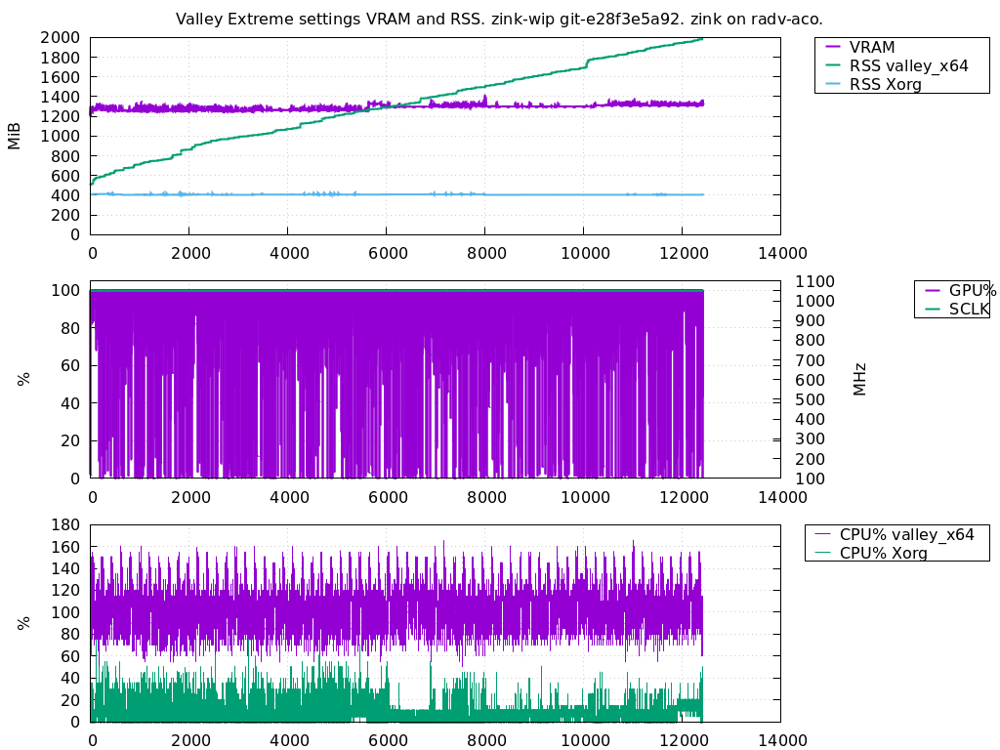

# Multimonitor

**A convenient command line utility to log system and process metrics.**

```
$ ./multimonitor --utc_nice --gpu=min --process valley_x64 --process Xorg 
Waiting for process valley_x64
Waiting for process valley_x64
Waiting for process valley_x64
Waiting for process valley_x64
For process name valley_x64 found pids: [1996445]
For process name Xorg found pids: [2066]
ticks_per_second: 100
With interval 200 ms and 100 ticks/s, expect CPU% error of +/- 5.0%
                                                                                                            Xorg
                                                                                     valley_x64               |
                                                                                          |                   |
                                                                                      1996445                2066
              DATETIME UTC            TIME      RELTIME    GPU%      VRAM      SCLK     CPU%        RSS     CPU%        RSS
2020-12-31T22:28:44.688313   709668.550807     0.200063    0.0%  309.6MiB  386.7MHz    0.00%      77MiB    5.00%     407MiB
2020-12-31T22:28:44.888319   709668.750763     0.400018    0.0%  309.6MiB  386.7MHz    0.00%      77MiB    0.00%     407MiB
2020-12-31T22:28:45.088325   709668.950799     0.600054    0.0%  311.6MiB  326.5MHz   15.00%      82MiB   10.00%     407MiB
2020-12-31T22:28:45.288331   709669.150770     0.800025    0.0%  311.6MiB  326.5MHz    0.00%      82MiB    0.00%     407MiB
2020-12-31T22:28:45.488337   709669.350800     1.000056    0.0%  311.6MiB  326.5MHz    0.00%      82MiB   10.00%     407MiB
2020-12-31T22:28:45.688343   709669.550775     1.200030    0.0%  311.6MiB  326.5MHz    0.00%      82MiB    5.00%     407MiB
2020-12-31T22:28:45.888350   709669.750795     1.400050    0.0%  311.6MiB  326.5MHz    0.00%      82MiB    5.00%     407MiB
2020-12-31T22:28:46.088356   709669.950932     1.600187    0.0%  311.6MiB  326.5MHz    0.00%      82MiB    0.00%     407MiB
2020-12-31T22:28:46.288362   709670.150692     1.799947    0.0%  294.1MiB  588.2MHz    5.01%      82MiB    5.01%     407MiB
2020-12-31T22:28:46.488368   709670.350815     2.000071    0.0%  294.1MiB  588.2MHz    0.00%      82MiB    5.00%     407MiB
2020-12-31T22:28:46.688374   709670.550755     2.200010    0.0%  294.1MiB  588.2MHz    5.00%      82MiB    5.00%     407MiB
2020-12-31T22:28:46.888381   709670.750808     2.400063    0.0%  294.1MiB  588.2MHz    0.00%      82MiB   10.00%     407MiB
2020-12-31T22:28:47.088387   709670.950767     2.600023    0.0%  294.1MiB  588.2MHz    0.00%      82MiB    5.00%     407MiB
2020-12-31T22:28:47.288393   709671.150816     2.800071    0.0%  298.2MiB  724.0MHz    5.00%      82MiB   10.00%     407MiB
2020-12-31T22:28:47.488399   709671.350754     3.000009    0.0%  298.2MiB  724.0MHz    0.00%      82MiB    0.00%     407MiB
2020-12-31T22:28:47.688405   709671.550808     3.200063    0.0%  298.2MiB  724.0MHz    0.00%      82MiB    0.00%     407MiB
2020-12-31T22:28:47.888411   709671.750837     3.400093    0.0%  298.2MiB  724.0MHz    0.00%      82MiB    5.00%     407MiB
2020-12-31T22:28:48.088418   709671.950742     3.599998    0.0%  298.2MiB  724.0MHz    0.00%      82MiB    0.00%     407MiB
```




## Options

```
Multimonitor - sample information about system and processes.
        --interval_msec Target interval for main metric sampling and output. (default: 200ms)
              --process List of process names to monitor
                 --pids List of process pids to monitor
          --process_map Assign short names to processes, i.e. a=firefox,b=123
                 --temp CPU temperature
                --sched CPU scheduler details
                   --vm Virtual memory subsystem
           --interrupts Interrupts details
                   --io System-wide IO details
                  --net System-wide networking metrics
                  --gpu Gather GPU stats. Available: none, min, max
         --mangohud_fps Gather FPS information for given processes using MangoHud RPC
         --wait_for_all Wait until all named processes are up
   --find_new_when_dead If the named process is dead, try searching again
       --exit_when_dead Stop collecting metrics and exit, when any of requested pids exits too
     --sum_all_matching For named processes, sum all matching processes metrics (sum CPU, smart memory sum)
          --auto_output Automatically create timestamped output file in current working directory with data, instead of using standard output
             --utc_nice Show first column as ISO 8601 formated date and time in UTC timezone. Otherwise use seconds since Unix epoch.
-H     --human_friendly Use human friendly (pretty) but still fixed units (default: true)
              --verbose Show timeing loop debug info
-h               --help This help information.
```

Primary purpose is debugging processes, system load, memory usage, memory
leaks, GPU usage, framerate tests, etc.

Combination of ps, top, iotop, powertop, radeontop, vmstat, free, mpstat,
pidstat, slabtop, cpufreq-info, mangohud and more, all in one. In some
areas the accuracy is significantly better than any of the above tools.

## Supported
  * Extremally accurate timestamps. Absolute (ISO 8601),
    monotonic from system start, and relative from tool startup.
  * Very accurate repetition rate (usually <10us).
  * Syscall delay compensation.
  * Asynchronous sampling of expensive statistics.
  * Automatic compensation of delays when calculating rates.
  * Rich set of available metrics:
    * System CPU
    * System Memory
    * Sustem IO, total and per-device
    * CPU temperature, frequency, and scalling governor
    * GPU frequency, temperature, load and memory usage
    * (multiple) Process CPU usage, thread count
    * (multiple) Process memory usage
    * (multiple) OpenGL / Vulkan fps / frametime measurments (using MangoHud rpc system)
    * (multiple) Process IO statistics
    * (multiple) Process scheduling and IO priority logging
    * System networking statistics
    * System-wide and per-process context switches and interrupts
    * (multiple) Custom asynchronous metrics (using external scripts), examples:
       * System power / current from PSU / SMBus
       * Number of files in a directory
       * ZFS statistics
       * GPU power save mode
       * Window resolution of a benchmarked game
    * Custom events annotation (i.e. using external scripts)
    * Ability to sample some metrics at slower rate than main metrics.
  * Human and machine friendly output in one format.
  * Self documenting output. Clear units.
  * Monitor processes by pid, or by name.
     * Continue monitoring even if pid dies, or stop. Configurable.
     * Ability to sum multiple pids or names. I.e. sum all processes
       with given name under one column.
  * Autostart/prestart - wait for a process by name, and start logging as
    soon as one is found.
  * Fast. 5Hz by default, 100Hz possible.
  * Extremally low CPU and memory overhead (<0.5% CPU, <5MiB).
  * Integration with Gnuplot for plotting.
  * Automatic detection of various failures, like signals, interrupts,
    processes death, slow syscalls / preemption, system sleep,
    process SIGSTOP, clock jumps, etc. Automatically output nan,
    or empty lines when discontinuities are detected, so plotting
    can use the data correctly.
  * Automatically calculate expected error / accuracy, and warn
    if it is low.

Many metrics support both rates and cummulative figures. Some other
measure only "gauges" (i.e. memory usage, GPU load or frequency).

The output format is a simple text format with nicely aligned and
annotated columns, but also optimized to be easily parsed by automated
tools, most notably Gnuplot. Relative and absolute timestamps allows
correlating with other tools and events, as well overlying multiple runs
for comparisson. Most of the data in various columns use fixed
non-configurable formats. This is mostly done to speed-up processing and
output, reduce memory allocations, and make it less likely for user to
mess things up. It also means the logs produced now, will have exactly
same format and units as the ones produced years from now, no matter the
used options. Which is great for comparing measurements with year old
logs.

Multimonitor is written in D programming language, and can be compiled
using GDC, LDC2 or DMD compilers. Multimonitor does use D standard
library Phobos, included with these compilers. There are no other
dependencies. Some parts of the code are written with `@nogc` to ensure
smooth and predictable performance. Other parts do use GC, but very
little allocations are actually performed. It is normal to see about 1 GC
cycle per hour in steady state. Code is optimized for correctness, and
speed, with extensive usage of metaprogramming facilities of D
programming language.

Only Linux is supported. Linux kernel 2.6.32+ required. There are no
plans to support other operating system, as there is a lot of Linux
specific code. FreeBSD version is a reasonable option tho, but would
require some porting and testing. Multimonitor extensively use `pread`
syscall, but `readfile` from Linux 5.11 is also a possibility.

Multimonitor is not a replacement for generic monitoring frameworks and
tools like Prometheus (including node-exporter), collectd, Nagios, etc.
These tools are extensible, support very long collections (even years),
from multiple sources and machines, query languages, dashboards,
alerting, application specific instrumentation, dynamic configuration
changes, resampling, time realignment of multiple metrics, interpolation,
etc. Also most of these tools do sample about once a minute, sometimes
once every 5 minutes.

Multimonitor instead is used for ad-hoc high-precission high-rate logging
of specific metrics, especially for monitoring few apps, without extra
instrumentation. Multimonitor output is also designed to be easily
consumed by other tools like gnuplot, awk, kolumny, etc.

Multimonitor is not indented for extremally high rate sampling. It is not
a general data acquisition system, nor it is suitable for isochronous
data sampling with extremally low jitter. 100Hz would be practical limit
of the multimonitor. Higher is possible, but not recommended, due to
better tools available (with lower disk usage, and lower jitter, and
lower CPU overheads). But i.e. sampling external sensors once per second,
like temperature, or power usage, are reasonable use cases, as long as
the fact that the output format is somehow verbose is acceptable. For
very constrainted systems (microcontrollers or small SBC systems, with
limited storage, small write throughput or slow network connectivity)
other solutions should be considered.

Multimonitor is also not well suited for very big number of metrics
collected. 40-60 is probably reasonable max, but is already hard to keep
track. Sure, more can be done, but there are better tools available for
this. Multimonitor is also not well suited for gathering variable length
statistics of generic type. I.e. want to see temperature of all SCSI
drives in the system, or core frequency of all 32 core on the CPU? Not
the best idea, as the number of columns or order in the output will very
between systems, making it very hard to process such files.

The author use it mostly to monitor GPU benchmarks during run, and log
CPU load, GPU load, GPU frequency, GPU temperature, GPU VRAM, benchmark
CPU load, benchmark RSS usage, benchmark thread count, benchmark active
thread count, benchmark min-avg-max framerates. These can be then fed to
gnuplot to do plots, possibly from different runs, for example with
different GPU driver version, different compiler options, etc.

Author was just tired of running 3 or 4 different tools concurrently
(from command line or ad-hoc scripts, which always got lost and forgoten,
so needed to be reinvented each time, usually with slighly different
format), all with own latencies, timestamps formats (or lack of them),
significant measurement inaccuracies, different units, too many columns
to easily count in gnuplot, then needing to do time offsets between
multiple input files to align them in time, and between different runs to
correlate changes, setup weird `awk` or `kolumny` scripts to, bring the
formats to sanity, do computations between them, or plot with titles, and
labels, etc. Multimonitor makes things more uniform, faster, more
accurate and easier to use.

Other tools, were too limiting, too high overhead or too much time to
setup. I.e. Prometheus can't really do sub-second scraping, and was too
inaccurate at high repetition rates, and took hours to setup or fully
automate.

## Future / TODO:
  * Linux perf integration, i.e. IPC, context switches, CPU migrations, cache
    hits / misses, TLS misses, branch mispredicions, etc.
  * Use pidfd or dirfd/openat for processing processes in /proc. Similary for
    searching hwmon entries.
  * Disk usage.
  * Output to file with file rotation / compression.
  * Trigger external tools periodically (i.e. generate webpage or image
    with plot) with new data.
  * More testing on Intel and Nvidia GPUs
  * More testing on SBCs, like Raspberry Pi, Orange Pi, Banana Pi, Odroid,
    etc.
  * Multi-arch QA (i386, amd64, arm64, ppc64el, riscv64, alpha, m68k, s390x).
  * More generic plugin framework, where each "Reader" class can dynamically
    register, providing own formatting of header and columns, adding own
    command line option parsing, own preferences of sync vs async, caching
    policy for async, prefered rates, etc.
  * Support for BSD systems (FreeBSD, NetBSD, OpenBSD, DragonFly).
  * More networking statistics (i.e. routing, iptable, etc)
  * NTP and general time and realtime offset / jitter monitoring.
  * Sampling metrics from Prometheues
  * Netlink TASKSTAT metrics
  * More Linux VM statistics for memory
  * Per-core CPU metrics
  * Better multi GPU measurements, i.e. iGPU + dGPU, 2x dGPU
  * Per-file system statistics, i.e. IO/s, kB/s.
  * Support more hwmon stuff, i.e. NVMe temperature.
  * smartmontools integration, i.e. HDD temperature.
  * Linux namespaces support.
  * Linux cgroups support.
  * KVM and Xen guest monitoring.
  * PCIe power status / link status / speed
  * Battery level readback. Charging power. Input / output voltage for USB PD, etc.
  * USB power / current output from host.
  * IMPI / OpenBMC integration for power
  * PMBus integration
  * A framework for I2C and One-Wire sensors maybe.
  * Ability to compute number of OTHER processes / threads active
    in the system, to estimate any background noise when doing benchmarks.
  * Lower overhead output formats, with nesting and per-object labels:
    * Protocol buffer output
    * JSON output
    * These could help with some stuff, like supporting multiple CPU cores,
      multiple network interfaces, multiple processes, multiple hard drives,
      while supporting order independenance by including proper names, or
      other stable ids, etc.
  * GPIB / IEEE 488 and LX support, i.e. reading voltage, current, resistance
    from multimeters, frequency counters, power supplies, electronic loads,
    etc. etc.
  * Logic analyzer support.
  * MIDI input, i.e. reading rotary encoders, pressure sensitive keyboards, etc.
  * SNMP readback sampling. It is an attrocious format, but could be useful to
    read metrics for example from network switches, or printers.
  * Octoprint / 3D printer status sampling, i.e. progress of 3D printing,
    amount of used fillament, temperature, etc.
  * Execute read queries in databases, i.e. arbitrary SELECT in SQLite, MySQL
    or PostgreSQL to track something, or performance of these queries
    (i.e. latency).
  * ODB 2 (automotive) support.
  * Configurable system and per-user deamon to capture some log with fixed
    format, with output file rotation.


## Explicitly not planned:
  * Data logging
  * Event logging
  * Streaming
  * Query language integration
  * Corss-machine integration
  * Windows or MacOS support.

