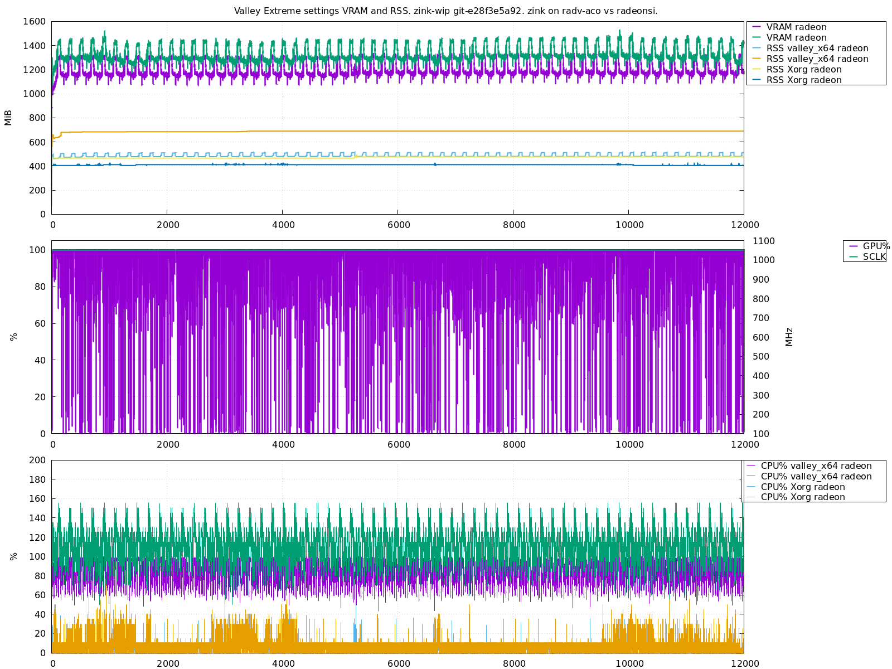

# `multimonitor`

**A convenient command line utility to log system and process metrics.**

```
$ multimonitor --utc_nice --gpu=min --process valley_x64 --process Xorg 
# Waiting for process valley_x64
# Waiting for process valley_x64
# Waiting for process valley_x64
# For process name valley_x64 found pids: [1996445]
# For process name Xorg found pids: [2066]
# ticks_per_second: 100
# With interval 200 ms and 100 ticks/s, expect CPU% error of ± 5.0%
#                                                                                                           Xorg
#                                                                                    valley_x64               |
#                                                                                         |                   |
#                                                                                     1996445                2066
              DATETIME-UTC            TIME      RELTIME    GPU%      VRAM      SCLK     CPU%        RSS     CPU%        RSS
2020-12-31T22:28:44.688313   709668.550807     0.200063    0.0%  309.6MiB  386.7MHz    0.00%      77MiB    5.00%     407MiB
2020-12-31T22:28:44.888319   709668.750763     0.400018    0.0%  309.6MiB  386.7MHz    0.00%      77MiB    0.00%     407MiB
2020-12-31T22:28:45.088325   709668.950799     0.600054    0.0%  311.6MiB  326.5MHz   15.00%      82MiB   10.00%     407MiB
2020-12-31T22:28:45.288331   709669.150770     0.800025    0.0%  311.6MiB  326.5MHz    0.00%      82MiB    0.00%     407MiB
2020-12-31T22:28:45.488337   709669.350800     1.000056    0.0%  311.6MiB  326.5MHz    0.00%      82MiB   10.00%     407MiB
2020-12-31T22:28:45.688343   709669.550775     1.200030    0.0%  311.6MiB  326.5MHz    0.00%      82MiB    5.00%     407MiB
2020-12-31T22:28:45.888350   709669.750795     1.400050    0.0%  311.6MiB  326.5MHz    0.00%      82MiB    5.00%     407MiB
2020-12-31T22:28:46.088356   709669.950932     1.600187    0.0%  311.6MiB  326.5MHz    0.00%      82MiB    0.00%     407MiB
2020-12-31T22:28:46.288362   709670.150692     1.799947    0.0%  294.1MiB  588.2MHz    5.01%      82MiB    5.01%     407MiB
2020-12-31T22:28:46.488368   709670.350815     2.000071    0.0%  294.1MiB  588.2MHz    0.00%      82MiB    5.00%     407MiB
2020-12-31T22:28:46.688374   709670.550755     2.200010    0.0%  294.1MiB  588.2MHz    5.00%      82MiB    5.00%     407MiB
2020-12-31T22:28:46.888381   709670.750808     2.400063    0.0%  294.1MiB  588.2MHz    0.00%      82MiB   10.00%     407MiB
2020-12-31T22:28:47.088387   709670.950767     2.600023    0.0%  294.1MiB  588.2MHz    0.00%      82MiB    5.00%     407MiB
2020-12-31T22:28:47.288393   709671.150816     2.800071    0.0%  298.2MiB  724.0MHz    5.00%      82MiB   10.00%     407MiB
2020-12-31T22:28:47.488399   709671.350754     3.000009    0.0%  298.2MiB  724.0MHz    0.00%      82MiB    0.00%     407MiB
2020-12-31T22:28:47.688405   709671.550808     3.200063    0.0%  298.2MiB  724.0MHz    0.00%      82MiB    0.00%     407MiB
2020-12-31T22:28:47.888411   709671.750837     3.400093    0.0%  298.2MiB  724.0MHz    0.00%      82MiB    5.00%     407MiB
2020-12-31T22:28:48.088418   709671.950742     3.599998    0.0%  298.2MiB  724.0MHz    0.00%      82MiB    0.00%     407MiB
```


## Options

```
Multimonitor - sample information about system and processes.
                  --sub Launch a single external command, monitor it just like
                        --pid and finish once all of them finish
                 --pids List of process pids to monitor
              --process List of process names to monitor
          --process_map Assign short names to processes, i.e. a=firefox,b=123
                 --temp CPU temperature
                --sched CPU scheduler details
                   --vm Virtual memory subsystem
           --interrupts Interrupts details
                   --io System-wide IO details. Available: none, min, max
                  --net System-wide networking metrics
                  --gpu Gather GPU stats. Available: none, min, max
         --mangohud_fps Gather FPS information for given processes using MangoHud RPC
                 --exec Run external command with arbitrary output once per sample
           --exec_async Run external command with arbitrary output asynchronously
                 --pipe Run external command and consume output lines as they come
     --async_delay_msec Change how often to run --exec_async and --gpu commands.
                        (default: 200ms)
         --wait_for_all Wait until all named processes are up
   --find_new_when_dead If the named process is dead, try searching again
       --exit_when_dead Stop collecting metrics and exit, when any of requested
                        pids exits too.
     --sum_all_matching For named processes, sum all matching processes metrics
                        (sum CPU, smart memory sum)
          --auto_output Automatically create timestamped output file in current
                        working directory with data, instead of using standard
                        output. (default: false)
        --interval_msec Target interval for main metric sampling and output.
                        (default: 200ms)
         --duration_sec How long to log. (default: forever)
                 --time Time mode, one of: relative, boottime, absolute, all.
                        (default: all)
             --utc_nice Show absolute time as ISO 8601 formated date and time in
                        UTC timezone. Otherwise Unix time is printed.
                        (default: false)
-H     --human_friendly Use human friendly (pretty), but still fixed units
                        (default: true)
              --verbose Show timeing loop debug info
-h               --help This help information.
```

Primary purpose is debugging processes, system load, memory usage, memory leaks,
GPU usage, frame rate tests, etc.

Combination of `ps`, `top`, `iotop`, `powertop`, `radeontop`, `vmstat`, `free`,
`mpstat`, `pidstat`, `slabtop`, `cpufreq-info`, `mangohud` and more, all in one.
In some areas the accuracy is significantly better than any of the above tools.

## Supported
  * Extremely accurate timestamps. Absolute (ISO 8601),
    monotonic from system start, and relative from tool startup.
  * Very accurate repetition rate (usually <10us).
  * Syscall delay compensation.
  * Asynchronous sampling of expensive statistics.
  * Automatic compensation of delays when calculating rates.
  * Rich set of available metrics:
    * System CPU
    * System Memory
    * System IO, total and per-device
    * CPU temperature, frequency, and scaling governor
    * GPU frequency, temperature, load and memory usage
    * (multiple) Process CPU usage, thread count
    * (multiple) Process memory usage
    * (multiple) OpenGL / Vulkan FPS / frame time measurements (using MangoHud
      RPC system)
    * (multiple) Process IO statistics
    * (multiple) Process scheduling and IO priority logging
    * System networking statistics
    * System-wide and per-process context switches and interrupts
    * (multiple) Custom asynchronous metrics (using external scripts), like:
       * System power / current from PSU / SMBus
       * Number of files in a directory
       * ZFS statistics
       * GPU power save mode
       * Window resolution of a benchmarked game
       * Many more easy to add on the fly
    * Custom events annotation (i.e. using external scripts)
    * Ability to sample some metrics at slower rate than main metrics.
  * Human and machine friendly output in one format.
  * Self documenting output. Clear units.
  * Monitor processes by pid, or by name.
     * Continue monitoring even if pid dies, or stop. Configurable.
     * Ability to sum multiple pids or names. I.e. sum all processes
       with given name under one column.
  * Autostart/prestart - wait for a process by name, and start logging as
    soon as one is found.
  * Fast. 5Hz by default, 100Hz possible.
  * Extremely low CPU and memory overhead (<0.5% CPU, <5MiB).
  * Integration with Gnuplot for plotting.
  * Automatic detection of various failures, like signals, interrupts,
    processes death, slow syscalls / preemption, system sleep,
    process SIGSTOP, clock jumps, etc. Automatically output nan,
    or empty lines when discontinuities are detected, so plotting
    can use the data correctly.
  * Automatically calculate expected error / accuracy, and warn
    if it is low.

Many metrics support both rates and cumulative figures. Some other measure only
"gauges" (i.e. memory usage, GPU load or frequency).

The output format is a simple text format with nicely aligned and annotated
columns, but also optimized to be easily parsed by automated tools, most notably
Gnuplot. Relative and absolute timestamps allows correlating with other tools and
events, as well overlying multiple runs for comparison. Most of the data in
various columns use fixed non-configurable formats. This is mostly done to
speed-up processing and output, reduce memory allocations, and make it less
likely for user to mess things up. It also means the logs produced now, will have
exactly same format and units as the ones produced years from now, no matter the
used options. Which is great for comparing measurements with year old logs.

## Examples of various modes

Some commands, like `--pid`, `--pids`, `--process`, `--sub`, `--exec`,
`--exec_async`, `--pipe` can be repated multiple times to monitor multiple
processes or pluging. Some, like `--pids`, also accept a comma separated lists.

Relative ordering of columns in the output, will in general follow relative
order of arguments. But some system level information will be output in more
rigid order. I.e. `--cpu`, `--io`, `--gpu`, will be displayed after timestamps,
in this order, and before any sub-process / per-process related ones.

Here is a general ordering:

  * Timestamps (influenced by `--utc_nice` and `--time`)
  * `--cpu`
  * `--temp`
  * `--mem`
  * `--gpu`
  * `--sched`
  * `--vm`
  * `--io`
  * `--net`
  * `--pids`, `--pid`
  * `--process`
  * `--sub`
  * `--mangohud_fps`
  * `--exec`
  * `--exec_async`
  * `--pipe`

Some ordering restrictions might be relaxed in the future.

### `--utc_nice`

```
$ multimonitor --utc_nice
              DATETIME-UTC            TIME      RELTIME
2020-12-31T22:28:44.688313   709668.550807     0.200063
2020-12-31T22:28:44.888319   709668.750763     0.400018
2020-12-31T22:28:45.088325   709668.950799     0.600054
```

Without this flag, Unix time is output in the first column instead.

```
# multimonitor ...
        UNIX-TIME            TIME      RELTIME
1609465795.020941   721738.570333     0.200061
1609465795.220947   721738.770319     0.400047
1609465795.424953   721738.970353     0.600081
1609465795.620959   721739.170320     0.800048
```

Note, Unix time is roughly number of seconds since Unix Epoch
(`1970-01-01 00:00:00 "UTC"`) minus leap seconds. A day in Unix time always has
exactly 86400 seconds. Unix time is often (even in official standards and
manuals) colloquially refereed as "seconds since the Epoch", even if that is not
strictly true.

### `--time`

To select just one of the 3 timestamp to be present in the output, use `--time`
with one of `absolute`, `boottime` or `relative`.

```
$ multimonitor --time=absolute
        UNIX-TIME
1609655314.023888
1609655314.223895
1609655314.423901
1609655314.623907
```

```
$ multimonitor --time=absolute --utc_nice
              DATETIME-UTC
2021-01-03T06:28:31.495809
2021-01-03T06:28:31.695815
2021-01-03T06:28:31.895821
2021-01-03T06:28:32.095828
```


```
$ multimonitor --time=boottime
           TIME
  911283.419439
  911283.619396
  911283.819425
  911284.019410
  911284.219418
```

```
$ multimonitor --time=relative
     RELTIME
    0.200084
    0.400050
    0.600066
    0.800058
    1.000044
```

### `--pids` / `--pid`

Monitor CPU% and RSS of processes by PID. Multiple `--pids` and `--pid` can be
specified.

`CPU%` of 100% means a fully utilized (by user space and system time spent in
kernel on behalf of the process) one core (or logical thread on the core). So for
example, a 8 thread CPU-bound process, on a 8 core system which is otherwise
idle, will show close to 800%. You can think of it as CPU seconds per second.
Utilization of 100% doesn't actually mean the core is fully utilized, it just
means that 100% of the time it was assigned to particular process, and not
assigned to other processes, interrupt handling or idle/sleep process. 100% CPU
can still have a lot of resources available that are not utilized (this is more
complicated with SMT), because of memory stalls, page faults, long dependency
chains, etc. If process is migrated between cores, the `CPU%` will track a total
time it was assigned and running on some cores. For multi-threaded processes, the
`CPU%` is a sum of all its threads.

`RSS` stands for "Resident (segment) size". It basically is a total amount of
used physical memory, so for example, it doesn't include swapped out memory.  Nor
does it count mapped memory, that wasn't yet allocated to physical memory. Be
careful when interpreting these numbers, for complex processes, and multi-process
setups, as shared memory (mostly libraries, but also buffers for communication)
can be counted multiple times for different processes. (For example: You can't
just add up all `RSS` figures for Firefox or Chrome, to get a total memory usage
for them).

```
$ multimonitor --pids 1
#                                                 systemd
#                                                     |
#                                                     1
        UNIX-TIME            TIME      RELTIME     CPU%        RSS
1609465795.020941   721738.570333     0.200061    0.00%      12MiB
1609465795.220947   721738.770319     0.400047    0.00%      12MiB
1609465795.424953   721738.970353     0.600081    0.00%      12MiB
1609465795.620959   721739.170320     0.800048    0.00%      12MiB
1609465795.824966   721739.370335     1.000063    0.00%      12MiB
1609465796.020972   721739.570303     1.200031    0.00%      12MiB
1609465796.224978   721739.770336     1.400064    0.00%      12MiB
```

Multiple PIDs can be specified, as a comma separated list (`--pids 1,2,3`), or
repeated arguments (`--pids 1 --pids 2`), or even `--pid 1,1 --pids 1,1`.

Columns will be ordered in the same order as requested pid in the list(s).

Above each `CPU%` figure a name of the process (`comm`) will be displayed,
together with its pid.

Note: On Linux, you can track individual threads using `--pids`, by passing
thread task id. These are not `pthread_t` IDs (POSIX Thread IDs). One way of
finding thread pids, is by checking `ls -1 /proc/<pid>/task` entries. Other
tools, like `ps` and `top` can also display all threads on the system, and do
filtering. Thread pids, can also be obtained from inside the process using
`gettid` call. There is no easy way to convert `pthread_t` to `tid`, even on
Linux, without hacky hacks. There is also no easy way to convert `tid` back to
`pthread_t`, or pthread name and such. This is because technically pthread to
kernel task threads doesn't need to be 1:1 mapping.


### `--process`

Monitor `CPU%` and `RSS` of process similar to `--pid`, but instead search for
process by name. Additionally by default, logging (and `RELTIME`) will not start
counting until all requested processes are found. Multiple `--process` can be
specified.

```
$ multimonitor --process steam
# Waiting for process steam
# Waiting for process steam
# Waiting for process steam
# For process name steam found pids: [2066]
#                                                   steam
#                                                      |
#                                                   2066
        UNIX-TIME            TIME      RELTIME     CPU%        RSS
1609465961.498080   721905.041175     0.200079   14.99%     405MiB
1609465961.694086   721905.241138     0.400043   10.00%     405MiB
1609465961.894092   721905.441157     0.600062   15.00%     405MiB
```

### `--sub`

Executes external command in the shell, and monitors it just like the `--pids`.
Multiple `--sub` can be specified. They will be started in left to right order,
and displayed also from left to right.

Because a shell is used, and the top most process is monitored, usually an
shell's `exec` need to be performed to switch execution to a desired process.
Otherwise one would be monitoring CPU and RSS of the shell itself, which is
usually not what one wants.

Shell is the intermediary, to allow using features like shell file globing,
redirection, piping, pre-start configuration and environment variable overrides,
or starting some auxiliary background processes.

Example:

```
$ multimonitor --io=min --sub "exec sha256sum /dev/random >/dev/null"
        UNIX-TIME            TIME      RELTIME       READ       WRITE    CPU%     RSS
1609566507.918133   822470.120617     0.200078    64MiB/s      0MiB/s  100.0%   1.8MiB
1609566508.122140   822470.320565     0.400026    65MiB/s      0MiB/s  100.0%   1.9MiB
1609566508.318146   822470.520595     0.600056  1001MiB/s      0MiB/s  100.0%   1.8MiB
1609566508.518152   822470.720580     0.800041  1010MiB/s      0MiB/s  100.0%   1.8MiB
1609566508.718158   822470.920588     1.000049  1031MiB/s      0MiB/s  100.0%   1.8MiB
1609566508.918164   822471.120587     1.200048  1022MiB/s      0MiB/s  100.0%   1.8MiB
1609566509.118170   822471.320584     1.400045  1031MiB/s      0MiB/s  100.0%   1.8MiB
1609566509.318177   822471.520587     1.600048  1022MiB/s      0MiB/s  100.0%   1.8MiB
...
```

The standard output is unchanged (it remains same as standard output of
`multimonitor`). If the launched programs do have substantial own output, it
might be wise to use shell redirection in each `--sub` invocation, or use
`--auto_output`.

If `--duration_sec` is specified, the after duration passes, all sub-processes
will immedietly receive `SIGTERM`, and if after short delay they still are
not terminated, then after additional short delay, all non-terminated ones
will receive `SIGKILL` and be waited for.

If the child process dies, `SIGCHLD` will be ignored, but the zombie process,
will still be sampled, it will read as 0% CPU and 0MiB RSS. In the future, it
might be possible to handle this signal, and instead show `nan`, while also
handling the death process to clean it from process tables.

If the `^C` is hit, or `multimonitor` dies in some other way, `SIGHUP` will be
delivered by kernel to the child processes, then reparanted under some other
system specific process (often pid 1). In the future, there might be an option to
call something like `prctl(PR_SET_PDEATHSIG, SIGTERM);` before doing actual
`exec` after the `fork`.

Or does it maybe sends `SIGINT` already? To check.

The processes for `--pipe` and `--exec` will most likely receive the SIGPIPE, in
addition to other signals mentioned above.

### `--gpu`

```
$ multimonitor --utc_nice --gpu=min
              DATETIME-UTC            TIME      RELTIME    GPU%      VRAM      SCLK
2020-12-31T22:28:44.688313   709668.550807     0.200063    0.0%  309.6MiB  386.7MHz
2020-12-31T22:28:44.888319   709668.750763     0.400018    0.0%  309.6MiB  386.7MHz
2020-12-31T22:28:45.088325   709668.950799     0.600054    0.0%  311.6MiB  326.5MHz
```

`--gpu=max` could provide more information, including various GPU sub-system
loads, memory clocks, temperature, and such.

GPU stats will always be displayed before any of monitored processes (specified
via `--pids`, `--pid`, `--process` or `--sub`), as well plugins (`--pipe`,
`--exec*`).

### `--io`

Shows system-wide block device IO.

```
$ multimonitor --utc_nice --io=min
              DATETIME-UTC            TIME      RELTIME      RDkB/s      WRkB/s
2021-02-02T05:43:48.568163   875927.542727     0.200118  164384KB/s       0KB/s
2021-02-02T05:43:48.768168   875927.742620     0.400011  165211KB/s       0KB/s
2021-02-02T05:43:48.968174   875927.942660     0.600052  163808KB/s       0KB/s
2021-02-02T05:43:49.168179   875928.142829     0.800221  164340KB/s       0KB/s
```

`--io=max` additionally provides information about swap bandwidth.

```
$ multimonitor --utc_nice --io=max
              DATETIME-UTC            TIME      RELTIME      RDkB/s      WRkB/s SWAPRDkB/s SWAPWRkB/s
2021-02-02T05:43:45.804091   875924.776632     0.200065  164425KB/s       0KB/s      0KB/s      0KB/s
2021-02-02T05:43:46.004096   875924.976592     0.400025  163875KB/s       0KB/s      0KB/s      0KB/s
2021-02-02T05:43:46.204101   875925.176618     0.600051  165097KB/s       0KB/s      0KB/s      0KB/s
2021-02-02T05:43:46.404107   875925.376602     0.800034  164493KB/s       0KB/s      0KB/s      0KB/s
```

IO stats will always be displayed before any of monitored processes (specified
via `--pids`, `--pid`, `--process` or `--sub`), as well plugins (`--pipe`,
`--exec*`).

### `--pipe`

Launches an asynchronous process and reads back lines from each. The process
should output fixed width and consistent output on each line.

```
$ multimonitor --pipe "while true; do date '+%s.%N'; sleep 1; done" \
               --pipe "while true; do cat /proc/loadavg; sleep 1; done" \
               --pipe "while true; do cat /proc/uptime; sleep 1; done"
        UNIX-TIME            TIME      RELTIME                 PIPE           PIPE                                 PIPE
1609465621.259576   721564.812290     0.200065 1609465621.112124784 3.44 3.73 3.86 4/1628 2125166 721583.31 22579423.26
1609465621.459583   721565.012258     0.400033 1609465621.112124784 3.44 3.73 3.86 4/1628 2125166 721583.31 22579423.26
1609465621.659589   721565.212438     0.600213 1609465621.112124784 3.44 3.73 3.86 4/1628 2125166 721583.31 22579423.26
```

You can think of these processes as multimonitor plugins.

### `--exec`

Executes synchronously external command on each sample. Newline characters from
the output are converted to spaces.

```
$ multimonitor --exec "awk '/^(nr_free_pages|nr_zone_inactive_anon)/ {print \$2;}' /proc/vmstat"
        UNIX-TIME            TIME      RELTIME             EXEC
1609478558.602970   734501.821340     0.200089 13816115 8242963
1609478558.802977   734502.021271     0.400020 13816141 8243038
1609478559.002983   734502.221306     0.600056 13816141 8243046
1609478559.202989   734502.421289     0.800038 13816141 8243050
1609478559.402995   734502.621292     1.000041 13816177 8243169
```

You can think of these processes as multimonitor plugins, to augment with extra
capabilities quickly.

### `--exec_async`

Executes asynchronously external command. Newlines from the output are converted 
to spaces.


```
$ multimonitor --exec_async 'echo 42 $(date +%s.%N)'
        UNIX-TIME            TIME      RELTIME                    EXEC
1609476390.052024   732333.326417     0.200084 42 1609476390.058566475
1609476390.252030   732333.526350     0.400016 42 1609476390.258601844
1609476390.452037   732333.726391     0.600057 42 1609476390.458978396
1609476390.652043   732333.926383     0.800050 42 1609476390.658840135
```

Caching behaviour can be changed with `--async_delay_msec` (default: 200ms).

A difference between the two can be ilustrated here:

```
$ multimonitor --exec "date +%s.%N" \
               --exec_async "date +%s.%N" \
               --async_delay_msec=1000
        UNIX-TIME            TIME      RELTIME                 EXEC                 EXEC
1609478808.394682   734751.606517     0.200071 1609478808.401597625 1609478808.200443789
1609478808.594688   734751.806484     0.400039 1609478808.601534096 1609478808.200443789
1609478808.794694   734752.006507     0.600062 1609478808.801675976 1609478808.200443789
1609478808.994700   734752.206494     0.800049 1609478809.001560833 1609478808.200443789
1609478809.194707   734752.406500     1.000055 1609478809.201414051 1609478808.200443789
1609478809.394713   734752.606497     1.200052 1609478809.401672778 1609478809.202125682
1609478809.594719   734752.806509     1.400064 1609478809.601640469 1609478809.202125682
1609478809.794725   734753.006488     1.600043 1609478809.801603550 1609478809.202125682
1609478809.994731   734753.206505     1.800060 1609478810.001602391 1609478809.202125682
1609478810.194737   734753.406499     2.000053 1609478810.201564425 1609478809.202125682
1609478810.394744   734753.606650     2.200204 1609478810.401723765 1609478810.203523733
1609478810.594750   734753.806403     2.399958 1609478810.601920961 1609478810.203523733
1609478810.794756   734754.006529     2.600083 1609478810.801647833 1609478810.203523733
1609478810.994762   734754.206483     2.800037 1609478811.001605257 1609478810.203523733
1609478811.194768   734754.406504     3.000059 1609478811.201543125 1609478810.203523733
1609478811.394774   734754.606501     3.200056 1609478811.401612507 1609478811.204954820
1609478811.594781   734754.806497     3.400051 1609478811.601693833 1609478811.204954820
```

Notice how the `--exec` part is executed every sample, but `--exec_async` on
average is executed every 5 samples.

`--exec_async` is excellent for more expensive computations, like calculating a
hash of a file, traversing big filesystem tree, reading from network, or reading
sysfs files that could be very slow. While the command is executing, the previous
saved state will be displayed, allowing one to continue logging uninterrupted
other things, as well asynchronously execute other command that use
`--exec_async`.


### `--pipe` with `--interval_msec=0`

`multimonitor` can act as a multiplexer from multiple sources in parallel. It can
for example prefix log files or outputs of a command with timestamps, but do so
even when using multiple files and processes in parallel. And monitor other
system metrics in parallel if desired. This is not a main usage of
`multimonitor`, but it is sometimes handy. A bit more convenient tool is `ts`
from `moreutils` is worth looking at (there are other handy tools there that
could be used together with `multimonitor`, for example `ifdata`, `pee` and
`sponge`).

When using `--interval_msec=0`, instead of sleeping, a pooling on all pipes to
consume their output will be performed.


```
$ sudo multimonitor --pipe "exec tail -f /var/log/syslog" \
                    --pipe "exec tail -f /var/log/kern.log" \
                    --interval_msec=0
...
...
```

This is not a super useful feature at the moment, because by default text on each
column is right aligned, making it somehow silly to use.

### Example of `--pipe` to monitor extra metrics for the process

Here we monitor GPU, process CPU and RSS, but additionally we monitor
number of memory mappings and VmSize (in KiB) using external script, run
continously. The `--pipe` scripts has a bit of extra boilerplate to find
automatically the process, and preserve the format (number of columns),
if the process is gone (so it is easier to parse later in other tools).

```
$ multimonitor \
  --gpu=med \
  --process cat \
  --pipe 'while true; do P=$(pidof -s cat); if [ "$P" != "" ]; then while wc -l "/proc/$P/maps" 2>/dev/null; do sleep 0.22; done; else echo "nan" "-"; fi; done' \
  --pipe 'while true; do P=$(pidof -s cat); if [ "$P" != "" ]; then while awk "/^VmSize/ {print \$2;}" "/proc/$P/status" 2>/dev/null; do sleep 0.22; done; else echo "nan"; fi; done'
# ProcStat Initializing ticks_per_second = 100
# ProcStat Initializing page_size_kb = 4
# Arguments: ["multimonitor", "--gpu=med", "--process", "cat", "--pipe", "while true; do P=$(pidof -s cat); if [ \"$P\" != \"\" ]; then while wc -l \"/proc/$P/maps\" 2>/dev/null; do sleep 0.22; done; else echo \"nan\" \"-\"; fi; done", "--pipe", "while true; do P=$(pidof -s cat); if [ \"$P\" != \"\" ]; then while awk \"/^VmSize/ {print \\$2;}\" \"/proc/$P/status\" 2>/dev/null; do sleep 0.22; done; else echo \"nan\"; fi; done"]
# Waiting for process cat
# Waiting for process cat
# Waiting for process cat
# Waiting for process cat
# Waiting for process cat
# Waiting for process cat
# Waiting for process cat
# Waiting for process cat
# Waiting for process cat
# For process name cat found pids: [451314]
# Spawned 451315 for --pipe: while true; do P=$(pidof -s cat); if [ "$P" != "" ]; then while wc -l "/proc/$P/maps" 2>/dev/null; do sleep 0.22; done; else echo "nan" "-"; fi; done
# Spawned 451320 for --pipe: while true; do P=$(pidof -s cat); if [ "$P" != "" ]; then while awk "/^VmSize/ {print \$2;}" "/proc/$P/status" 2>/dev/null; do sleep 0.22; done; else echo "nan"; fi; done
        UNIX-TIME            TIME      RELTIME GPU%       VRAM    SCLK  GPUT    GPUP      CPU%        RSS                 PIPE PIPE
1620578670.951151    30070.936277     0.200060   0%   209.4MiB 1050MHz  35°C 112.13W     0.00%       0MiB  
1620578671.151156    30071.136242     0.400025   0%   209.4MiB 1050MHz  35°C 112.13W     0.00%       0MiB 24 /proc/451314/maps 5440
1620578671.351161    30071.336259     0.600041   0%   201.9MiB 1050MHz  35°C 112.13W     0.00%       0MiB 24 /proc/451314/maps 5440
1620578671.551167    30071.536250     0.800033   0%   201.9MiB 1050MHz  35°C 112.13W     0.00%       0MiB 24 /proc/451314/maps 5440
1620578671.751172    30071.736255     1.000037   0%   201.9MiB 1050MHz  35°C 112.13W     0.00%       0MiB 24 /proc/451314/maps 5440
1620578671.951177    30071.936253     1.200035   0%   201.9MiB 1050MHz  35°C 112.13W     0.00%       0MiB 24 /proc/451314/maps 5440
1620578672.151183    30072.136258     1.400041   0%   202.4MiB 1050MHz  35°C 112.13W     0.00%       0MiB 24 /proc/451314/maps 5440
1620578672.351188    30072.336251     1.600034   0%   202.4MiB 1050MHz  35°C 112.13W     0.00%       0MiB 24 /proc/451314/maps 5440
1620578672.551194    30072.536254     1.800036   0%   202.4MiB 1050MHz  35°C 112.13W     0.00%       0MiB 24 /proc/451314/maps 5440
1620578672.751199    30072.736253     2.000035   0%   202.4MiB 1050MHz  35°C 112.13W     0.00%       0MiB 24 /proc/451314/maps 5440
1620578672.951204    30072.936253     2.200036   0%   202.4MiB 1050MHz  35°C 112.13W     0.00%       0MiB 24 /proc/451314/maps 5440
1620578673.151210    30073.136254     2.400036   0%   202.4MiB 1050MHz  35°C 112.13W     0.00%       0MiB 24 /proc/451314/maps 5440
1620578673.351215    30073.336257     2.600040   0%   202.4MiB 1050MHz  35°C 112.13W     0.00%       0MiB 24 /proc/451314/maps 5440
1620578673.551220    30073.536251     2.800034   0%   202.4MiB 1050MHz  35°C 112.13W     0.00%       0MiB 24 /proc/451314/maps 5440
1620578673.751226    30073.736254     3.000036   0%   202.4MiB 1050MHz  35°C 112.13W     0.00%       0MiB 24 /proc/451314/maps 5440
1620578673.951231    30073.936253     3.200036   0%   202.4MiB 1050MHz  35°C 112.13W      nan%       0MiB 24 /proc/451314/maps 5440
1620578674.151236    30074.136263     3.400046   0%   202.4MiB 1050MHz  35°C 112.13W      nan%       0MiB                nan -  nan
1620578674.351242    30074.336259     3.600042   0%   202.4MiB 1050MHz  35°C 112.15W      nan%       0MiB                nan -  nan
1620578674.551247    30074.536256     3.800039   0%   202.4MiB 1050MHz  35°C 112.15W      nan%       0MiB                nan -  nan
1620578674.751252    30074.736259     4.000041   0%   202.4MiB 1050MHz  35°C 112.15W      nan%       0MiB                nan -  nan
1620578674.951258    30074.936257     4.200040   0%   203.7MiB 1050MHz  35°C 112.13W      nan%       0MiB                nan -  nan
1620578675.151263    30075.136259     4.400041   0%   203.7MiB 1050MHz  35°C 112.13W      nan%       0MiB                nan -  nan
1620578675.351269    30075.336263     4.600045   0%   203.7MiB 1050MHz  35°C 112.13W      nan%       0MiB                nan -  nan
```

Note, how we use single quotes to pass `--pipe` script - this allows
easier use of `$` inside the script.

Often, it might be easier to put such `--pipe` scripts into own script
files, for easier reuse.

Also note that we use slightly bigger sleep (220ms), compared to the
interval of multimonitor (200ms), so we are not flooded by output of
`--pipe` script, which by the time is display is stale / old (by many
lines). Instead, we allow the reader to block asynchronously, and display
previous value for one cycle, but updated value will come just on the
next cycle / line, not 10 or 100 lines later, depending on pipe/fifo
buffering. (PS. Note that in some locales `sleep 0.22` will not work,
use a comma, like `sleep 0,22`, or switch to more sane locale).

Alternatively a simple approach is to use `--exec_async`, which is easier
to use, but has a bit extra overhead, and might be delayed a bit extra
due to internal caching of commands executed using `--exec_async`:

```
$ multimonitor \
  --gpu=med \
  --process cat \
  --exec_async 'wc -l "/proc/$(pidof -s cat)/maps" 2>/dev/null || echo nan -' \
  --exec_async 'awk "/^VmSize/ {print \$2;}" "/proc/$(pidof -s cat)/status" || echo nan'
```

Of course, if you know the pid before hand and the target process is
already running, you can compute it and pass once before launching the
`multimonitor`, to make script even simpler and slightly faster too.

```
$ P=$(pidof -s cat)
$ multimonitor \
  --gpu=med \
  --pid $P \
  --exec_async "wc -l '/proc/$P/maps' 2>/dev/null || echo nan -" \
  --exec_async "awk '/^VmSize/ {print \$2;}' '/proc/$P/status' || echo nan"
```

Notice the inversion of single quotes and double quotes, to make it work
correctly.

### `--exit_when_dead` with `--sub`, `--pids` or `--process`

When `--exit_when_dead=true` is used, then `multimonitor` will finish
(and terminate other processes) as soon as any of the monitored processes
is in zombie, dead state or gone. Even if that is before the end of
`--duration_sec` settings.

```
$ multimonitor --exit_when_dead --sub="exec sleep 2" --duration_sec=3600
# Spawned 2708230 for --sub: exec sleep 2
        UNIX-TIME            TIME      RELTIME      CPU%        RSS
1614694484.970314   768700.437572     0.200172     0.00%       0MiB
1614694485.170316   768700.637394     0.399994     0.00%       0MiB
1614694485.370317   768700.837564     0.600165     0.00%       0MiB
1614694485.570318   768701.037498     0.800098     0.00%       0MiB
1614694485.770320   768701.237419     1.000019     0.00%       0MiB
1614694485.970321   768701.437574     1.200174     0.00%       0MiB
1614694486.170322   768701.637485     1.400085     0.00%       0MiB
1614694486.370324   768701.837537     1.600137     0.00%       0MiB
1614694486.570325   768702.037491     1.800092     0.00%       0MiB
1614694486.770326   768702.237535     2.000135     0.00%       0MiB
$
```

```
$ multimonitor_ldc --exit_when_dead --sub="exec sleep 2" --sub="exec sleep 100" --duration_sec=3600
# Spawned 2727867 for --sub: exec sleep 2
# Spawned 2727868 for --sub: exec sleep 100
        UNIX-TIME            TIME      RELTIME      CPU%        RSS      CPU%        RSS
1614694874.680933   769090.149657     0.200049     0.00%       0MiB     0.00%       0MiB
1614694874.880935   769090.349626     0.400018     0.00%       0MiB     0.00%       0MiB
1614694875.080936   769090.549686     0.600078     0.00%       0MiB     0.00%       0MiB
1614694875.280938   769090.749626     0.800018     0.00%       0MiB     0.00%       0MiB
1614694875.480940   769090.949682     1.000074     0.00%       0MiB     0.00%       0MiB
1614694875.680942   769091.149658     1.200050     0.00%       0MiB     0.00%       0MiB
1614694875.880943   769091.349651     1.400043     0.00%       0MiB     0.00%       0MiB
1614694876.080945   769091.549656     1.600048     0.00%       0MiB     0.00%       0MiB
1614694876.280947   769091.749663     1.800055     0.00%       0MiB     0.00%       0MiB
1614694876.480949   769091.949641     2.000033     0.00%       0MiB     0.00%       0MiB
# Sending SIGTERM to not yet terminated pid 2727868
```

Without this argument, the multimonitor will keep reporting (including
possibly other metrics) until duration is finished, even if any or all
processes are done:

```
$ ./multimonitor_ldc --exit_when_dead=false --sub="exec sleep 2" --duration_sec=3600
# Spawned 2708485 for --sub: exec sleep 2
        UNIX-TIME            TIME      RELTIME      CPU%        RSS
1614694563.114823   768778.583917     0.200051     0.00%       0MiB
1614694563.314824   768778.783901     0.400035     0.00%       0MiB
1614694563.514825   768778.983913     0.600046     0.00%       0MiB
1614694563.714827   768779.183920     0.800053     0.00%       0MiB
1614694563.914828   768779.383904     1.000038     0.00%       0MiB
1614694564.114829   768779.583923     1.200057     0.00%       0MiB
1614694564.314831   768779.783897     1.400031     0.00%       0MiB
1614694564.514832   768779.983923     1.600056     0.00%       0MiB
1614694564.718833   768780.184043     1.800176     0.00%       0MiB
1614694564.914835   768780.383834     1.999968     0.00%       0MiB
1614694565.114836   768780.583934     2.200068     0.00%       0MiB
1614694565.314837   768780.783898     2.400032     0.00%       0MiB
1614694565.514838   768780.983894     2.600028     0.00%       0MiB
1614694565.714840   768781.183896     2.800029     0.00%       0MiB
1614694565.914841   768781.383904     3.000037     0.00%       0MiB
1614694566.114842   768781.583919     3.200052     0.00%       0MiB
1614694566.314844   768781.783887     3.400021     0.00%       0MiB
1614694566.514845   768781.983901     3.600034     0.00%       0MiB
1614694566.714846   768782.183894     3.800028     0.00%       0MiB
1614694566.914848   768782.383899     4.000033     0.00%       0MiB
1614694567.114849   768782.583880     4.200013     0.00%       0MiB
1614694567.314850   768782.783921     4.400055     0.00%       0MiB
...
...
...
```

During that period, dead processes might have their `CPU%` figure
reported as `NaN%` or `nan%` or `0.00%`. For external processes also the
`RSS` might be reported as `NaNMiB` or `nanMiB` or `0MiB`, after they are
gone, for example:

```
$ ( sleep 3 & );  # Process we will be monitoring.
$ sleep 1;        # Give it some time to start.
$ multimonitor --exit_when_dead=false --process="sleep" --duration_sec=4
# For process name sleep found pids: [2717459]
        UNIX-TIME            TIME      RELTIME      CPU%        RSS
1614694744.711994   768960.183894     0.200052     0.00%       0MiB
1614694744.911996   768960.383852     0.400010     0.00%       0MiB
1614694745.111997   768960.583890     0.600047     0.00%       0MiB
1614694745.311998   768960.783867     0.800024     0.00%       0MiB
1614694745.512000   768960.983882     1.000039     0.00%       0MiB
1614694745.712001   768961.183871     1.200029     0.00%       0MiB
1614694745.912002   768961.383893     1.400050     0.00%       0MiB
1614694746.112003   768961.583865     1.600023     0.00%       0MiB
1614694746.312005   768961.783884     1.800041      nan%       0MiB
1614694746.512006   768961.983868     2.000026      nan%       0MiB
1614694746.712007   768962.183880     2.200038      nan%       0MiB
1614694746.912009   768962.383890     2.400047      nan%       0MiB
1614694747.112010   768962.583872     2.600029      nan%       0MiB
1614694747.312011   768962.783895     2.800052      nan%       0MiB
1614694747.512012   768962.983883     3.000040      nan%       0MiB
1614694747.712014   768963.183895     3.200053      nan%       0MiB
1614694747.912015   768963.383888     3.400046      nan%       0MiB
1614694748.112016   768963.583888     3.600046      nan%       0MiB
1614694748.312018   768963.783887     3.800045      nan%       0MiB
1614694748.512019   768963.983889     4.000047      nan%       0MiB
$
```

TODO(baryluk): Implement `--exit_when_dead=any` and `--exit_when_dead=all`.

TODO(baryluk): Implement `--exit_when_dead=anysub` and
`--exit_when_dead=allsub`, which would only take into account the `--sub`
processes in the early termination logic, not the other ones.

TODO(baryluk): If all (at least one) monitored processes are of `--sub`
type, automatically use `--exit_when_dead=allsub`.


TODO(baryluk): Implement / fix this for `--pipe` too?

### `--buffered`

By default `multimonitor` flushes unconditionally output after each line. This
makes it nicer to use with other tools like `tee`, `grep`, `awk`, `kolumny` or
`tail -f`, for post-processing output in real time, as well saving to a file and
displaying in terminal at the same time. Without this, it would often appear
there is no output, despite small interval used, and for reasonable intervals it
makes sense to disable full output buffering, to make `multimonitor` more
convenient to use.

However, for very small intervals, it might come at somehow high overhead. If you
use `--interval_msec=50`, or less, it might be better to use buffered output. To
enable it use `--buffered`. A standard C library `FILE` buffers will be used.
This is usually 4KiB, and the behavior can be manipulated using `stdbuf` command
for example (`stdbuf --output=1M multimonitor --buffered --interval_msec=10`
can be used to use large - 1MiB - output buffer). Note however, that because
`multimonitor` does syscalls to `clock_nanosleep` and `clock_gettime` at least
once per each output line, the overheads savings aren't going to that
significant.

### Consuming output

You are free to do whatever you like with the output. Very often it will be just
scrolling in the terminal for human consumption. However, often it will be saved
to a file or processed in real time by other tools. Here are some suggestions.

  * Usually column 3 will be used as x axis, as it is easiest to use,
    but there are cases where other columns will be more appropriate.

### gnuplot

Gnuplot is an advanced command-line driven graphing utility.
https://www.gnuplot.info/

This is just scratching the surface of what is possible with gnuplot, but should
provide some ideas what is possible. The author is using Gnuplot for 20 years and
still discovering new useful features in it.

  * As an input to gnuplot. For example `gnuplot -e "plot 'mm.txt' using 3:4; pause -1"`
    A good idea for long runs is to output `multimonitor` stdout to file
    (redirecting in shell, using `--auto_output` or using `tee`). Then as it
    grows, see results in gnuplot by doing `replot`, or re executing your own
    gnuplot script. This makes it a very interactive and insightful, even while
    the output is still being created by `multimonitor`.
  * Gnuplot can process multiple columns, either as single plot, or multiple
    plots. For example: `plot "mm.txt" using 3:($4+$6)` will sum up columns
    4 and 6 and plot them as one line. And `plot "mm.txt" u 3:4, "" u 3:6`
    will plot them as two separate lines on the same plot (`""` means to use
    same input file as previous one).
  * For very short runs, especially when using `--duration` and/or `--sub`, it
    might be possible to use `multimonitor` directly in the gnuplot using its
    popen functionality, like this:
    `plot "<multimonitor --gpu --duration_sec=5 --sub 'exec glxgears'" using 3:4`,
    but this do have limited usability (it is hard to plot more than one column
    from single `multimonitor` run), and usually it is better to save output to
    the file instead (this could be done using gnuplot `system` of course,
    or some external script or by hand). In general I don't recommend it.
  * When using gnuplot, and trying to plot multiple separate runs, it is handy
    to use `for` construct. Like
    `plot for [filename in system("ls -1 mm*.txt")] filename u 3:4 w step title filename noenhanced`
    or similar. This will automatically create multiple plots for multiple files
    using same column specifiers. Of course multiple other plots can be ploted
    on the same plot, some possible using rigth axis, or using `multiplot`
    functionality. `noenhahced` is to not convert underscore as a hint to do
    subscripts. Without it `mm_1.txt`, would convert into `mm₁.txt` instead,
    which is ugly, and not what you usually want.
  * When processing multiple files in gnuplot using `for`, it might be handy to
    modify the title based on a part of filename, for example:
     `… t sprintf("CPU %s", strstrt(filename, "zink") > 0 ? "Z" : "R"))`
    to extract some details from a filename, instead of a full filename.
  * Similar trick can be applied to offsets of time or normalization of values:
    `plot for [...] filename u (offset(filename, $3):4 w step`
    where `offset`, could be defined similar to this:
    `offset(filename, t) = strstrt(filename, "zink" > 0 ? 123.1 : 125.0`.
  * When using `multiplot` feature. It often is a good idea to make left and
    right margins a fixed size, so the time axis aligns properly and perfectly.
    Combined with grid, and disabling xtics for all but the last plot, is
    another neat trick to increase the information density.
  * Using `set term sixelgd` (or `GNUPLOT_TERM=sixelgd`) in a terminal emulator,
    supporting sixel protocol, allows to easily view graphs directly in your
    terminal (even over SSH). mlterm, xterm, terminology for X11 do support it.
    yarf for Linux framebuffer (without X11). libvte (Gnome/Mate Terminal,
    Terminator) support is coming. Otherwise, using `pngcairo`, `pdfcairo`,
    `svg` for saving to files, or using `wxt` for interactive display is
    recommended.

See example `*.gnuplot` files for some inspirations.

http://gnuplot.sourceforge.net/demo_5.5/ is also helpful for new users.

### awk, sed, grep, ...

  * As input to `awk` (or sometimes `grep` or `sed`), for example to do simple
    calculations between columns, or to detect specific patterns. Example:
    `multimonitor --gpu | awk '{ if ($4 > 80) print $0; }'` will only display
    lines with high GPU usage. Doing sums, moving averages, or ratios between
    different columns, or computing own rates is another option.
  * The `awk` (or other tools) could be processing that in real time using
    pipes, or as a post-processing step later, either in a script, or i.e. in
    `popen` construct of gnuplot.
    Example: `plot "<awk '{print $3, $5+$7;}' mm.txt using 1:2`

### kolumny

`kolumny` (https://github.com/baryluk/kolumny) is a type of streaming command
line spreadsheet, primarly used for processing multiple input files in parallel.
It is a good match to processing `multimonitor` output, as well for many many
more uses.

  * It is extremely handy for doing comparisons between separate runs of
    `multimonitor`, because of its ability to do mathematical
    post-processing between multiple files. Example:
    `kolumny mm1.txt u t1:=3,~a:=4 mm2.txt u ~t2:=3,~b:=4 :~check(isclose(t1,t2)) :a/b`
    * Here, the `t1:=3` means to use column 3 from file `mm1.txt` and assign it to
      variable `t1`, and print it.
    * `~a:=4` means to read column 4 from file
      `mm1.txt` and assign it to variable `a`, without printing it.
    * Reading multiple columns at once is possible using arrays too, for example
      `~pids:=4...12`.
    * After input file definitions and main variables, various statements and
      expressions are used. Each expression starts with `:` (or
      with `#`, which means to turn it off).
    * `:~check(isclose(t1,t2))` is to ensure `t1` and `t2` are close (which use
      3rd column, so that `RELTIME` from both files are aligned on each row).
    * `~` is to suppress output of `True` to the output.
    * `:a/b` computes value of `a/b` (ratio between 4th columns) and outputs it.
    * It is also possible to declare new variables, i.e. `:~ratio:=a/b`, and use
      them in other expression (as long there are no cycles, they will be
      evaluated in proper order, while maintaining same print order as given on
      command line - forward references are supported). For example
      `:(1.0-ratio)**2` to output a new column that uses other column, columns
      or expressions defined on command line.
    * Any Python expression can be used, and extra functions can be imported
      using `--import`.
    * There are also tricks to carry variables and state across rows, do dynamic
      column lookups, arrays (multiple columns) and other tricks.
    * `u` is shorthand for `using` (just like Gnuplot).
    * Similarly `s` is shorthand for `skip` (just like Gnuplot).
    *  `kolumny` also supports reading directly from standard input, or
      subprocesses `<program` (Just like Gnuplot), so
      `multimonitor --pids 1,2,3 | kolumny - u t:=3,~cm:=4...9 ':sum(cm[0:2:])'`
      is an option for example (to sum CPU usage of 3 processes).
      Or equivalently:
      `kolumny "<multimonitor --pids 1,2,3" u t:=3,~cm:=4...9 ':sum(cm[0:2:])'"`
      The second form supports multiple conccurent input processes (and other
      input files), if required.
    * `kolumny` can also read variable amount of columns into its arrays, by
      indexing from right:
      `kolumny "<multimonitor --process firefox" u t:=3,~cpu_mem:=4...-1 ':~cpu:=cpu_mem[0:2:]' ':sum(cpu)'`
      will sum CPU usage of all firefox processes, no matter how many there are.
  * Combining `kolumny` and `gnuplot` in one, example:
    `plot "<kolumny mm1.txt using t1:=3,~a:=4 mm2.txt using ~t2:=3,~b:=4 :~check(isclose(t1,t2)) :a/b" using 1:2 with lines`
    to compute ratio between column 4 from file `mm1.txt` and `mm2.txt`,
    without needing to code this in a separate file or script. The CLI syntax
    of `kolumny` was optimized to not require extensive use of quoting and
    escaping when using with tandem with gnuplot (this is why usage of spaces
    is limited, and varaiables doesn't use `$` like `awk` for example).
  * Of course it is also to combine all in one gnuplot+multimonitor+kolumny,
    but even on a single command line, but these can get out of hand quickly,
    if you are not very familiar with these tools.

### Other simple uses, `paste`, Python

  * For extremely simple cases, i.e. two files being compared, as primitive
    substitute for `kolumny` is to use `paste`, then combine with other tools
    (like `awk` or `gnuplot`). Example:
    `paste mm1.txt mm2.txt | awk '{print $3, $4/$9; }'` could be roughly
    equivalent to example above, assuming 5 columns in `mm1.txt` file.
    `kolumny` has advantage of easier processing of bigger number of files,
    and not needing to manually count columns in `paste` output, which is very
    tedious and errorprone, especially when changing output format.
  * Consuming data in various programming languages like Python or R, should
    be equally easy. Often as easy as doing `line.split()`.

### Spreadsheets

Importing or just pasting into your favorite spreadsheet (LibreOffice Calc,
Google Sheets, Microsoft Excel, Gnumeric, Calligra Sheets, etc) is obviously also
a reasonable option, if you are into that.

  * Be aware of date handling and autoformating / "autocorrecting" that many of
    these programs do. Usually incorrectly!
    * For example `nan` will not be recognized usually.
    * Similarly Unix time might not be fully preserved with full accuracy,
      and usually microseconds will be silently dropped.
    * Also some software might convert Unix time back to date and time not
      correctly, so double check your software (Example `1609631793.656` should
      translate to `2021-01-02T23:56:33.656+00:00`).
  * These tools does not like too much units attached directly to numbers,
    so using `--human_friendly=false` is probably good idea. If you already
    captured some files, something like
    `sed -E -e 's/[KMGT]i?(B|Hz|)\b//gi' -e 's/%//g'` could often do
    a decent job removing these units.

### Other formats

Right now `multimonitor` doesn't support output in other formats. Author thinks
that the simple column and white space design is super easy to use with many
tools (as can be seen above with various example, like `gnuplot`, `awk`,
`kolumny`). If there is sufficient demand, from users, it might be possible to
easily add `csv`, `tsv` or `ods` output formats for example.

For now, using output as is, or with `--human_friendly=false`, should work well.

### Tips and tricks

In `--pipe`, `--exec` and `--exec_async` be aware of shell escaping rules.
This is quite important for example when using `awk`. See examples above how it
could be made to work.

If the text returned by `--pipe`, `--exec` and `--exec_async`, is going to have a
variable number of elements, or a text with unknown number of words, AND it is
not a last column of `multimonitor`, it is recommended to put such output into
double quotes, so Gnuplot (and CSV) can consider it a single column anyway.

Example:

```
$ multimonitor --exec 'echo "\"$(date)\""'
SECONDS-FROM-EPOCH            TIME      RELTIME                              EXEC
 1609563691.299229   819653.500171     0.200085 "Sat 02 Jan 2021 05:01:31 AM UTC"
 1609563691.499235   819653.700140     0.400054 "Sat 02 Jan 2021 05:01:31 AM UTC"
 1609563691.699241   819653.900147     0.600061 "Sat 02 Jan 2021 05:01:31 AM UTC"
 1609563691.899248   819654.100148     0.800062 "Sat 02 Jan 2021 05:01:31 AM UTC"

$ LC_ALL=pl_PL.UTF-8 TZ=Europe/Zurich multimonitor --exec 'echo "\"$(date)\""'
SECONDS-FROM-EPOCH            TIME      RELTIME                            EXEC
 1609563713.831924   819676.035970     0.200090 "sob, 2 sty 2021, 06:01:53 CET"
 1609563714.031930   819676.235925     0.400045 "sob, 2 sty 2021, 06:01:54 CET"
 1609563714.231936   819676.435947     0.600067 "sob, 2 sty 2021, 06:01:54 CET"
 1609563714.431942   819676.635932     0.800052 "sob, 2 sty 2021, 06:01:54 CET"
```

Similar, it might be useful when using `ls -l`, which might format modification
times, in multitude of ways (affected by relative time, time zone, locale
installed, locale set, user preferences set in shell aliases or environment
variables etc, etc).

Usually these problems can be completely avoided, by properly constructing
environment, or command line options. In other cases (i.e. reading actual content
of some dynamic file, or output from network), it might still be good to do
quoting.

TODO(baryluk): Add `--qexec` (quoted exec), to do it automatically (as well turn
any other quotes into escaped quotes in the output).

Sometimes when using shell pipes in `--pipe`, it might be wise to unbuffer the
output, this can be done using `unbuffer` or `stdbuf -oL`, example:

```
$ multimonitor --pipe 'sudo stdbuf -oL tail -f /var/log/syslog | stdbuf -oL sed -E -e "s/^(.* kernel: )//"'
SECONDS-FROM-EPOCH            TIME      RELTIME                                                                       PIPE
 1609565358.558647   821320.761188     0.200214 [821272.965974] usb usb8-port1: Cannot enable. Maybe the USB cable is bad?
 1609565358.758653   821320.960940     0.399966 [821277.038003] usb usb8-port1: Cannot enable. Maybe the USB cable is bad?
 1609565358.958659   821321.161257     0.600282 [821281.117976] usb usb8-port1: Cannot enable. Maybe the USB cable is bad?
 1609565359.158665   821321.360902     0.799928 [821285.201977] usb usb8-port1: Cannot enable. Maybe the USB cable is bad?
 1609565359.358672   821321.561090     1.000115 [821289.273981] usb usb8-port1: Cannot enable. Maybe the USB cable is bad?
...
```

TODO(baryluk): Maybe add option to suppress new line output, or compress it to
empty, if the output of `--exec`, `--pipe`, etc, is same as before. Could be
interesting to mark event transitions, while maintaining a readability.

TODO(baryluk): It would be nice to interpret numbers from the output as
cumulative, and let the `multimonitor` calculate rates. There is many sources
that would work really well for this, for example: `/proc/<pid>/io`,
`/proc/vmstat`, `ip -s l`. Maybe `--exec_rate` ?

TODO(baryluk): Conversely, how about also `--exec_cumul`, so we SUM the numbers
from the pipe, or integrate in time, interpreting samples as average value, but
also taking into account the delay between calls. We can also do version that
just does sum (i.e. if the command returns current cumulative number, and then
resets it to zero).

TODO(baryluk): A more modular approach would be better, for example
`--exec:async:in_cumul:out_rate:cache=5s "exec something"`, this would allow
passing extra options and flags easily to each exec, and also allow for changing
order of options, without needing to remember all things. Other options `sync`,
`text`, `format`, etc. This might be handing when reading multiple values from a
single command, where some values are rates, some others are not, some should be
ignored, etc. Also, `:off`, could be used to keep it on the command line, parse,
but ultimately ignore. (similar to '#' prefix in `kolumny`, could be supported
too probably).

## Notes

`multimonitor` is written in D programming language, and can be compiled using
GDC, LDC2 or DMD compilers. `multimonitor` does use D standard library Phobos,
included with these compilers. There are no other dependencies. Some parts of the
code are written with `@nogc` to ensure smooth and predictable performance. Other
parts do use GC, but very little allocations are actually performed. It is normal
to see about 1 GC collection cycle (each ≈1ms) per hour in steady state. Code is
optimized for correctness, and speed, with extensive usage of meta programming
facilities of D programming language.

Only Linux is supported. Linux kernel 2.6.32+ required. There are no plans to
support other operating system, as there is a lot of Linux specific code. FreeBSD
version is a reasonable option tho, but would require some porting and testing.
`multimonitor` extensively use `pread` syscall, but `readfile` from Linux 5.11 is
also a possibility.

`multimonitor` is not a replacement for generic monitoring frameworks and tools
like Prometheus (including node-exporter), collectd, Nagios, etc. These tools are
extensible, support very long collections (even years), from multiple sources and
machines, query languages, dashboards, alerting, application specific
instrumentation, dynamic configuration changes, resampling, time realignment of
multiple metrics, interpolation, etc. Also most of these tools do sample about
once a minute, sometimes once every 5 minutes.

`multimonitor` instead is used for ad-hoc high-precision high-rate logging of
specific metrics, especially for monitoring few apps, without extra
instrumentation. `multimonitor` output is also designed to be easily consumed by
other tools like gnuplot, awk, kolumny, etc.

`multimonitor` is not indented for extremely high rate sampling. It is not a
general data acquisition system, nor it is suitable for isochronous data sampling
with extremely low jitter. 100Hz would be practical limit of the `multimonitor`.
Higher is possible, but not recommended, due to better tools available (with
lower disk usage, and lower jitter, and lower CPU overheads). But i.e. sampling
external sensors once per second, like temperature, or power usage, are
reasonable use cases, as long as the fact that the output format is somehow
verbose is acceptable. For very constrained systems (microcontrollers or small
SBC systems, with limited storage, small write throughput or slow network
connectivity) other solutions should be considered.

`multimonitor` is also not well suited for very big number of metrics collected.
40-60 is probably reasonable max, but is already hard to keep track. Sure, more
can be done, but there are better tools available for this. `multimonitor` is
also not well suited for gathering variable length statistics of generic type.
I.e. want to see temperature of all SCSI drives in the system, or core frequency
of all 32 core on the CPU? Not the best idea, as the number of columns or order
in the output will very between systems, making it very hard to process such
files.

The author use it mostly to monitor GPU benchmarks during run, and log CPU load,
GPU load, GPU frequency, GPU temperature, GPU VRAM, benchmark CPU load, benchmark
RSS usage, benchmark thread count, benchmark active thread count, benchmark
min-avg-max frame rates. These can be then fed to Gnuplot to do plots, possibly
from different runs, for example with different GPU driver version, different
compiler options, etc.

Author was just tired of running 3 or 4 different tools concurrently (from
command line or ad-hoc scripts, which always got lost and forgotten, so needed to
be reinvented each time, usually with slightly different format), all with own
latencies, timestamps formats (or lack of them), significant measurement
inaccuracies, different units, too many columns to easily count in gnuplot, then
needing to do time offsets between multiple input files to align them in time,
and between different runs to correlate changes, setup weird `awk` or `kolumny`
scripts to, bring the formats to sanity, do computations between them, or plot
with titles, and labels, etc. `multimonitor` makes things more uniform, faster,
more accurate and easier to use.

Other tools, were too limiting, too high overhead or too much time to setup. I.e.
Prometheus can't really do sub-second scraping, and was too inaccurate at high
repetition rates, and took hours to setup or fully automate.

With `multimonitor` graphs like this to do comparisons of many metrics between
different setups are easy to do:



## Future / TODO / Ideas:

  * Linux `perf` integration, i.e. IPC, context switches, CPU migrations, cache
    hits / misses, TLS misses, branch mispredicions, etc.
  * Use `pidfd` or `dirfd`/`openat` for processing processes in `/proc` and
    `/sys`. Similarly for searching `hwmon` entries.
  * Disk usage.
  * Output to file with file rotation / compression.
  * Trigger external tools periodically (i.e. generate webpage or image
    with plot) with new data.
  * More testing on Intel and Nvidia GPUs
  * More testing on SBCs, like Raspberry Pi, Orange Pi, Banana Pi, Odroid,
    etc.
  * Multi-arch QA (i386, amd64, arm64, ppc64el, riscv64, alpha, m68k, s390x).
  * More generic plugin framework, where each "Reader" class can dynamically
    register, providing own formatting of header and columns, adding own
    command line option parsing, own preferences of sync vs async, caching
    policy for async, preferred rates, etc.
  * Support for BSD systems (FreeBSD, NetBSD, OpenBSD, DragonFly).
  * More networking statistics (i.e. routing, iptable, etc)
  * NTP and general time and realtime offset / jitter monitoring.
  * Sampling metrics from Prometheus
  * Netlink TASKSTAT metrics
  * More Linux VM statistics for memory
  * Per-core CPU metrics
  * Better multi GPU measurements, i.e. iGPU + dGPU, 2x dGPU
  * Per-file system statistics, i.e. IO/s, kB/s.
  * Support more `hwmon` stuff, i.e. NVMe temperature.
  * `smartmontools` integration, i.e. HDD temperature.
  * Linux namespaces support.
  * Linux `cgroups` support.
  * KVM and Xen guest monitoring.
  * PCIe power status / link status / speed
  * Battery level readback. Charging power. Input / output voltage for USB PD, etc.
  * USB power / current output from host.
  * IMPI / OpenBMC integration for power
  * PMBus integration
  * A framework for I2C and One-Wire sensors maybe.
  * Ability to compute number of OTHER processes / threads active
    in the system, to estimate any background noise when doing benchmarks.
  * Lower overhead output formats, with nesting and per-object labels:
    * Protocol buffer output
    * JSON output
    * These could help with some stuff, like supporting multiple CPU cores,
      multiple network interfaces, multiple processes, multiple hard drives,
      while supporting order independence by including proper names, or
      other stable ids, etc.
  * GPIB / IEEE 488 and LX support, i.e. reading voltage, current, resistance
    from multimeters, frequency counters, power supplies, electronic loads,
    etc. etc.
  * Logic analyzer support.
  * MIDI input, i.e. reading rotary encoders, pressure sensitive keyboards, etc.
  * SNMP readback sampling. It is an atrocious format, but could be useful to
    read metrics for example from network switches, or printers.
  * Octoprint / 3D printer status sampling, i.e. progress of 3D printing,
    amount of used filament, temperature, etc.
  * Execute read queries in databases, i.e. arbitrary SELECT in SQLite, MySQL
    or PostgreSQL to track something, or performance of these queries
    (i.e. latency).
  * ODB 2 (automotive) support.
  * Configurable system and per-user daemon to capture some log with fixed
    format, with output file rotation.


## Explicitly not planned:

  * Generic logging.
  * Event logging.
  * Streaming to databases, or such. You can use other tools to do that with
    `multimonitor` output.
  * Query language integration. Instead you can feed data from `multimonitor`
    to lets say `kolumny`, Python's `pandas` or `numpy`, or SQL database of your
    choice.
  * Built-in data processing. These can be done using other tools easily,
    like gnuplot, `kolumny`, `awk`, or small Python program.
  * GUI integrated into it. It should be possible to create a separate
    GUI program ("driver") that launches `multimonitor` and shows results
    on graphs, possibly in real-time, and allows to easily configure
    command line, if needed.
  * Cross-machine integration. You can just call `multimonitor` on different
    machines using `ssh` and merge files if needed, either directly, using
    `kolumny`, or feed directly to tools that don't require time alignment,
    like Gnuplot.
  * Windows or MacOS support. Too much work, complications to the code and
    author doesn't use them.
  * Config files - all options should be passed explicitly on the command line
    for full reproducibility. (However: It might be wise to allow setting
    `--utc_nice` or `--interval_msec` by default using an environment variable,
    without loosing column numbering).

